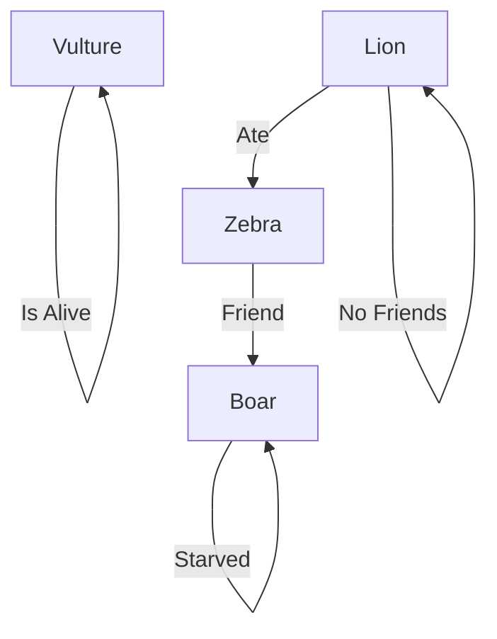

We kill the gargoyles and save [[Orvex Ocrammas]]. He's an anthropologist hired by [[Valindra Cimber|Shadowmantle]] to visit [[The Lost City of Mezero]]. We buy out the remainder of his contract for 50gp.

## The Tale of the Nine Trickster Gods
Long ago, the god [[Ubtao]] hardened his heart and vowed to weep for the people of [[Omu]] no longer. The rains stopped, the jungle withered and died, and death swept through Omu.
One morning, a wise zorbo emerged from her hollow tree and spoke to the dying Omuans. To convince [[Ubtao]] of their worth, she decided to cook him a stew made from all their good qualities. Catching such virtues wouldn't be easy, so she asked a wily almiraj to help her. The [[Almiraj]] snuck recklessness in the pot, which she saw as a virtue, and [[Ubtao]] spat out the stew when he tasted it. From that day on, [[Obo'laka]] the zorbo and [[I'jin]] the almiraj became terrible enemies.
At noon, a brave kamadan hopped down from her rock. She saw the evil in the Omuans' hearts and decided to lance it like a troublesome boil. The kamadan fashioned a holy spear, but she left it by the riverbank and a crafty grung stole it. In her rage, [[Shagambi]] the kamadan forgot all about the Omuans and chased [[Nangnang]] the grung forever across the sky.
When evening came, a wily eblis stepped from his reed hut. He didn't like the Omuans, but without them he'd have no one to play his tricks on. The eblis sent a marsh frog to reason with [[Ubtao]], but the frog was angry and decided to wrestle the god instead. This amused [[Ubtao]], so he gave the frog tentacles to make it stronger. When [[Kubazan]] the froghemoth returned to [[Papazotl]] the eblis, he chased [[Papazotl]] into the swamp with his new tentacles.
That night, a su-monster broke into [[Ubtao]]'s palace and stole a pail of water for the Omuans. When the god came running to find it, the su-monster hid the pail in a jaculi's burrow. [[Ubtao]] asked the jungle animals where his water was hidden, and [[Moa]] the jaculi was too honest to lie. When [[Wongo]] the su-monster found out how [[Moa]] had betrayed him, he vowed to catch the jaculi and eat him up.
All the while, [[Unkh]] the flail snail lived deep under the earth. The noise of the other animals fighting made her slither up to the surface, and when day dawned over her shell, the light blinded [[Ubtao]] and made his eyes water. Life returned to [[Omu]], and the people built shrines to honor the animals who'd saved them.

## Wagons!
Team Cimber goes to clear the [[I'jin]] (bunny unicorn) shrine. We head north towards the overturned wagon and the mad monkey shrine.

[[Morgan]] goes to grab a flower garland from the grown. [[Sylvos]] notices a small Chwinga in the bushes. The Chwinga stares at [[Morgan]] and seems to really want the flower garland. It puts the garland on [[Brysh]] and she gets a lovely magical buff for the day.

## Shrines!
As we enter the monkey shrine, the sound of Monkey laughter pierces our minds and shakes our skulls. However when [[Locke Hancock|Locke]] enters, a voice says "This is my Sanctuary" to him. Then the monkey voices stopped for everyone.

Inside we find four masks. "[[Wongo]]'s friend knows where to pour the water"

| Animal | Light Ray | Inscription |
| ---- | ---- | ---- |
| A vulture | Left hand | "One of the others has no friends" |
| A zebra | Right foot | "My only friend starved to death" |
| A boar | Left foot | "The vulture is lucky to be alive" |
| A lion | Right hand | "I ate one of the boar's friends" |
Lion ate the zebra
The zebra is friends with the boar
The boar starved to death
The lion has no friends

[[Morgan]] is placed with a dreadful choice. "Take the prize and curse your friends, or fight my children to claim it". He choses to fight and calls every inside to fight su-monsters.

We defeat the mind monkeys and get the puzzle cube of [[Wongo]].